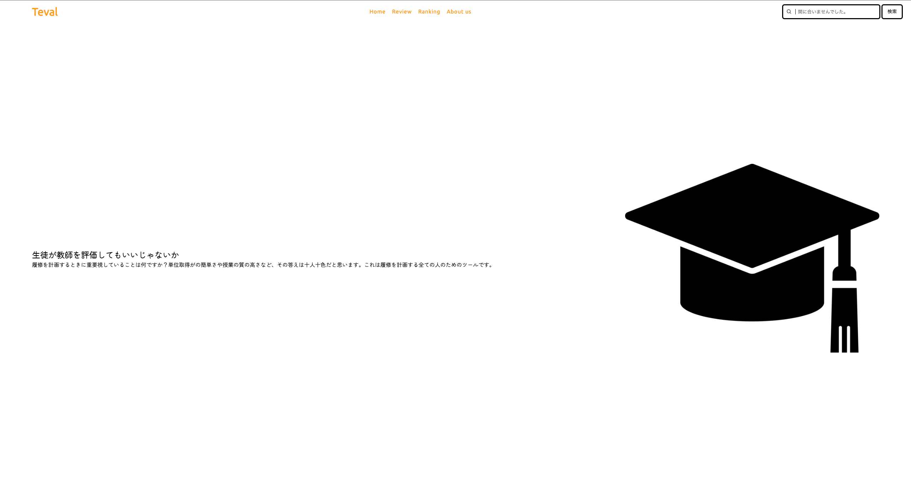

# Teval

## 製品概要

授業の履修取り消し率や総合評価を表示するサービス。
[Teval デモページ](http://ec2-35-78-195-92.ap-northeast-1.compute.amazonaws.com/Ranking/Ranking.html)

### 背景(製品開発のきっかけ、課題等）

履修計画を考えるとき、この授業を取るべきか判断に悩む場面が数多くあります。そこで、大学の履修データから履修人数や履修取り消し率を分析して可視化するサービスを提案します。大学で公開されている履修データを取得して、どの授業が最も多くの学生に履修されているかといった情報を提供し、履修計画の参考に役立ててられるようにすることが目的です。

### 製品説明（具体的な製品の説明）

### 特長

#### 1. 授業の履修取り消し率を可視化

日ごとの履修情報を取得することで、差分取って履修取り消し率を分析することができます。履修取り消し率が高い授業は、授業の内容が難しいということが多いため、履修取り消し率が高い授業を取るべきか判断する際に参考にできます。

#### 2. 授業の総合評価を可視化

大学では授業評価アンケートを行なっており、その結果が学内で公開されています。PDFのデータ形式でデータが公開されているため、Pythonライブラリのtabulaを使ってデータをPandas Dataframenoに変換してデータ分析を実現しました。今回はその一部のデータを使って、授業の総合評価を可視化しています。

### 解決出来ること

* 一部の科目の履修取り消し率が、本来よりも多く算出されてしまう不具合がありました。その原因を特定できたものの実装が間に合っていないため、今回のデモページで表示される履修取り消し率は正確ではありません。

### 今後の展望

* 履修取り消し率の不具合を解消し、正確な履修取り消し率を表示するようにします。
* 計算量が多く履修データの分析に時間がかかっているため、余分な処理を削減し、高速化を図ります。

### 注力したこと（こだわり等）

* シンプルなウェブデザインを意識し、ユーザーが直感的に操作できるようにしました。
* 短期間で完成できるように、なるべくシンプルな技術を用いて実装しました。

## 開発技術

### 活用した技術

#### API・データ

* 大学の履修情報(データを一部加工しています)

#### フレームワーク・ライブラリ・モジュール

* Python (データ処理）
* Pandas (データ分析)
* Beautifulsoup (スクレイピング)
* HTML/CSS/JavaScript (フロントエンド)
* AWS EC2 (サーバー)

### 独自技術

#### ハッカソンで開発した独自機能・技術

* 分析したデータ情報をjson形式で出力し、JavaScriptで可視化しています。DjangoやNode.jsなどのフレームワークを使用することなく実行できるため、コストを最小限に抑えることができます。
